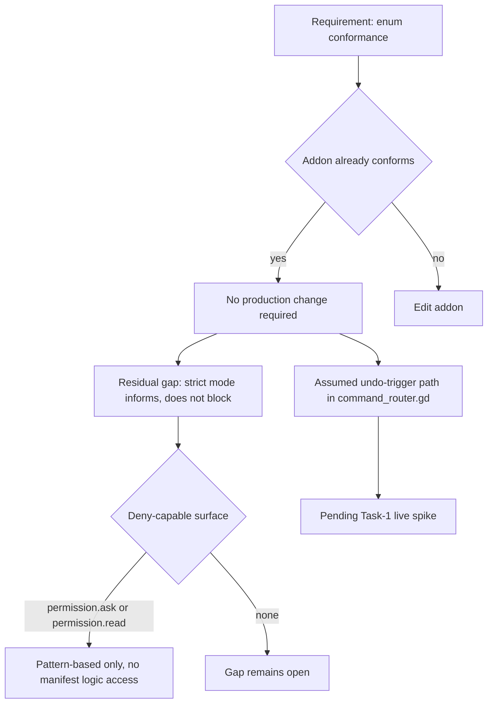

# No Code Change Required

"No code change required" is the outcome of a verification pass in which a planned production edit turned out to be unnecessary because the existing implementation already satisfied the requirement. It matters for two reasons. First, it prevents churn: editing code that already conforms adds review surface and regression risk for no behavioral gain. Second, it is a narrow claim. Establishing that no change is required for one requirement says nothing about adjacent gaps, and it says nothing about assumptions that were never verified. This article covers the conformance finding itself, the behavioral gap that survives it, and the unverified assumption that remains open.

## The conformance finding

The core result is direct: no production change was needed because the addon already conforms to the enum [3][6]. The requirement was checked against the addon's existing behavior, and the existing behavior already matched. There was no partial match to patch, no migration to write, and no compatibility shim to add. The correct action was to record the finding and leave the production code untouched [3][6].

This is the strongest form of the result. It is not "the change is small" or "the change can be deferred" — it is that the change has no content, because the target state is the current state.

## What "no change" does not cover

The conformance finding is scoped to the enum. It does not close the one real behavioral gap identified in the same pass: strict mode informs rather than blocks [1][4]. Strict mode reports; it does not prevent. That distinction is the whole gap.

The only deny-capable surface available is opencode's `permission.ask` hook or a `permission.read` rule [1][4]. Either can refuse an operation, which is what blocking requires. But both are pattern-based, and neither has access to the manifest logic [1][4]. So the deny-capable surface cannot express the condition that actually matters — it can match on shape, not on the manifest-derived decision. A rule can be written; it cannot be written to encode the same reasoning strict mode uses to inform.

The practical consequence is that "no code change required" is true for the enum and false as a general statement about enforcement. The gap is not a missing edit; it is a missing capability in the surface that would have to carry the edit.

## An assumption still pending verification

One path in the same area is explicitly hedged rather than settled. The `_cmd_undo` comment at `command_router.gd:248-250` states that the undo-trigger path is an assumed form pending the Task-1 live spike [2][5]. The comment is a marker, not a conclusion: the shape of the path is believed, not observed.

This is the reason the "no change required" result should be read alongside the hedge. A conformance check can pass against an assumed form and still be wrong if the assumption does not hold under live conditions. The Task-1 live spike is the step that converts the assumption into a verified fact [2][5].

## Flow of the verification outcome

## Summary

The enum requirement is satisfied by existing code, so no production change is required [3][6]. Strict mode still informs rather than blocks, and the only deny-capable surfaces are pattern-based with no access to the manifest logic [1][4]. The undo-trigger path remains an assumed form pending the Task-1 live spike [2][5].

## See also

- Enum conformance checks
- Strict mode semantics: inform versus block
- `permission.ask` hook and `permission.read` rules
- Manifest logic and pattern-based matching limits
- `command_router.gd` undo-trigger path
- Task-1 live spike

---

_Citations link to claims in evidence/claims/. Generated on 2026-09-21._
