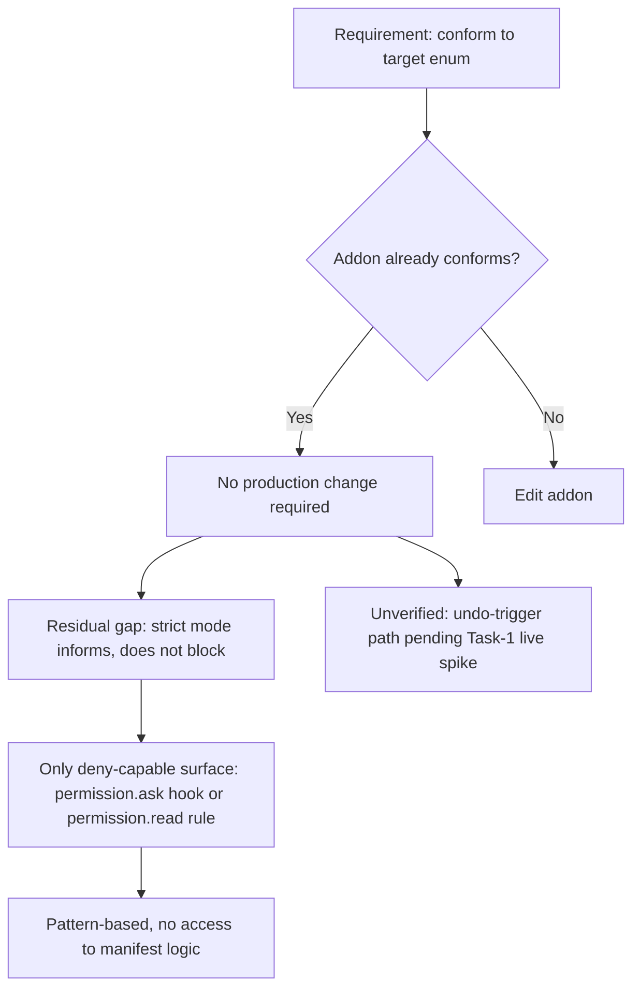

# No Code Change Required

"No code change required" is a verification outcome, not a null result. It records that a requirement was checked against existing code and found already satisfied, so the correct action was to leave production code untouched. In this case, no production change was needed because the addon already conforms to the enum [3][6]. That finding is worth writing down precisely because it is invisible in a diff: a later reader sees no commit and cannot tell whether the work was done and passed, or skipped entirely.

The outcome also has boundaries. Conformance to the enum is certified; enforcement behavior and one code path are not. Separating those categories is the point of the record.

## The conformance finding

The primary result is that the addon already conforms to the enum, and therefore no production change was needed [3][6]. This is the strongest form of the outcome: the requirement was met by code as written, and the appropriate response was to avoid a refactor toward a nominal target that would have added risk without changing behavior. Documenting the check preserves the evidence that the requirement was evaluated rather than overlooked.

## Residual gap: strict mode informs rather than blocks

The one real behavioral gap is that strict mode informs rather than blocks [1][4]. Strict mode surfaces a violation; it does not prevent one. The only deny-capable surface available is opencode's `permission.ask` hook or a `permission.read` rule [1][4]. Both are pattern-based and have no access to the manifest logic [1][4].

That last constraint is structural. The enforcement boundary sits outside the code that actually knows whether a given action is permitted, so the pattern matcher can only approximate the decision the manifest would make. This is not a configuration oversight that tighter patterns would fix — the deny-capable surface simply cannot see the inputs the manifest uses. Any expectation of blocking behavior has to be scoped to what pattern matching can express.

## Unverified assumption: the undo trigger path

The `_cmd_undo` comment at command_router.gd:248-250 hedges that the undo-trigger path is an assumed form pending the Task-1 live spike [2][5]. The path is documented as an assumption rather than a confirmed behavior. Until the live spike runs, the undo trigger should be treated as unvalidated.

This is a different category of residual risk from the strict-mode gap. The strict-mode gap is known and characterized; the undo trigger is unknown pending measurement. Both survive the "no code change required" verdict, and neither is resolved by it.

## What the outcome does and does not certify

The verdict certifies enum conformance [3][6]. It does not certify blocking enforcement, which strict mode does not provide [1][4], and it does not certify the undo-trigger path, which remains an assumption pending the Task-1 live spike [2][5].

Read this way, "no code change required" is a scoped claim. It says the enum requirement is satisfied by existing code and that editing production code would have been unnecessary churn. It does not say the system blocks what it should, and it does not say the undo trigger behaves as assumed. Those two items remain open and are tracked separately.

## See also

- Enum conformance
- Strict mode (inform vs. block)
- `permission.ask` hook
- `permission.read` rule
- Manifest logic
- Task-1 live spike
- `command_router.gd` `_cmd_undo`

---

_Citations link to claims in evidence/claims/. Generated on 2026-09-21._
