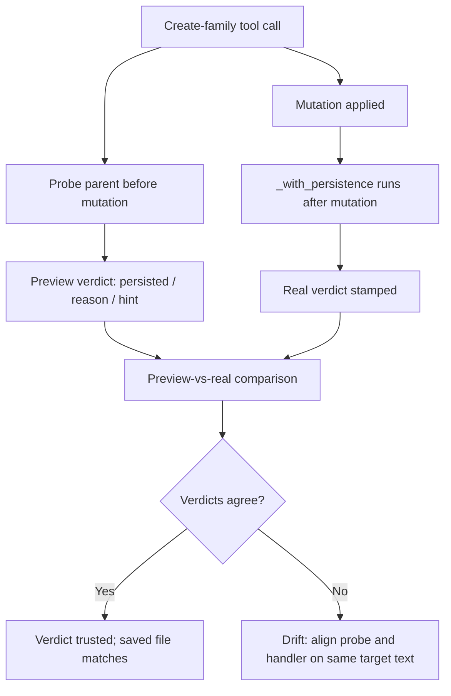

# Node Persistence in Godot

Node persistence, in this context, is the question of whether a node or resource created or edited through an editor addon actually survives a scene save. It matters because the failure mode is silent: a tool call can report success while the saved file contains nothing. This article covers the persistence verdicts the addon stamps, the preview-versus-real drift found in live testing, and the probes still outstanding.

## Why verdicts matter

Creating a node under a non-editable instanced child loses the new node on save; this was verified live as the T1 case [1]. The addon reports `persisted: false` with reason `instanced_child_not_editable` and a hint [12]. Related editor behaviour reinforces the point: the `set_editable_children` tool refuses local nodes, which would otherwise be a silent no-op [18], and moving a project file breaks every scene or script that references the old path [13]. Godot 4.4+ exposes the editor's rename machinery via `EditorInterface`/`EditorFileSystem` and `ResourceUID`, which is what makes path-aware handling feasible [14].

## How the addon stamps verdicts

All 13 create-family handlers now probe the parent before the mutation and stamp `persisted`/`reason`/`hint` [15]. `batch_set_property` and `apply_node_edits` carry a `persistence[]` array with one `{node_path, persisted, reason?, hint?}` entry per applied or edited target [16]. A live end-to-end test shows the saved file agrees with every verdict, with `test_persistence_e2e` green on Godot 4.7.2 [17].

## Preview versus real drift

Two mismatches surfaced. For `cmd_create_tile`, the preview says "This TileSet is embedded" while the real run says "This TileSetAtlasSource is embedded", because the probe predicts the node's resource class and the handler reports the created resource's class [4]. For `cmd_create_animation {'name': 'walk'}`, the preview says `persisted: True` while the real run reports `persisted: false, reason: embedded_in_other_resource` [5]. The cause is that the `AnimationLibrary` the animation lands in is embedded in `tmp_e2e_persist2_inner.tscn`, but `animation_probe(node_path, name)` only names the node, so the probe predicts the node's verdict instead of the library's [6]. Underlying both is ordering: the probe runs before the mutation while the handler's `_with_persistence` runs after it [7].

## Proposed fixes

Three alignments are proposed. `cmd_create_animation` should probe like the resource-slot probes — a library-aware probe, as #476 did for `tile_set`/`tree_root` slots — or the preview-vs-real test should compare `persisted` only for animation-creates [8]. The real run should stamp the verdict from the same target path the probe used (pre-rename), or the probe should pass the new name [9]. The embedded-resource reason's class word should be derived from the same object on both paths [10]. The reporter concludes the test is doing its job by catching real drift and that the fix is to align probe and handler on the same target text [11].

## Outstanding probes and pending mappings

`delete_node`, `move_node`, and `duplicate_node` under instance subtrees are extrapolated rather than probed, and each needs a live probe before a verdict is stamped [2]. Separately, several commands map to pending states: `cmd_get_recording` maps to `recording_pending` [20], `cmd_get_property_samples` maps to `capture_pending` [21], and `cmd_get_performance_monitors` maps to `probe_pending` [22]. The live e2e test `tests/integration/test_game_output_e2e.py` launches a real headless editor and plays a scratch scene whose script prints into all three streams [23].

## Handoff record

Verified rules, the 13-case save table, and line refs are recorded in the untracked file `458-persistence-truth-handoff.md` [3]. PR #505 was merged on 2026-09-18 [19].

## See also

- Instanced scenes and editable children
- `ResourceUID` and editor rename machinery
- Preview-versus-real test harness
- Persistence verdict schema (`persisted` / `reason` / `hint`)

---

_Citations link to claims in evidence/claims/. Generated on 2026-09-21._
