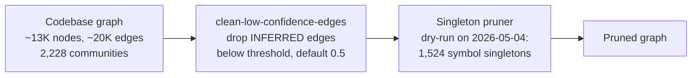

The NomikaiList knowledge graph is a codebase-derived graph that models symbols, their relationships, and the community structure that emerges from them. It matters because it is the substrate for automated maintenance operations: filtering low-confidence edges and pruning isolated nodes are the two cleanup passes described in the available evidence. This article covers the graph's scale, its edge-confidence policy, and the singleton-pruning pass, along with the numbers observed on the 2026-05-04 snapshot.

## Graph Scale and Structure

The NomikaiList codebase graph is approximately 13K nodes and 20K edges, partitioned into 2,228 communities [1][4]. The node count and the community count are the two figures that recur across the source material, and they define the working size of the graph: roughly six edges per node on average, spread over a few thousand detected communities.

A dated snapshot refines the node figure. On the 2026-05-04 graph, the node count was 12,984, with the same 2,228 communities [3][6]. The consistency of the community count between the approximate figure and the dated snapshot suggests the community structure is stable relative to node-level churn, though the evidence does not state this directly.

## Edge Confidence Filtering

Edges in the graph carry a provenance type, and at least one type — `INFERRED` — carries a confidence score. The `clean-low-confidence-edges` script drops `INFERRED` edges whose confidence falls below a threshold, and that threshold defaults to 0.5 [2][5].

Two properties of this pass are worth noting for anyone running it. First, it is scoped to `INFERRED` edges, so edges of other provenance types are not affected by the threshold. Second, the threshold is a parameter with a default rather than a hard-coded constant, which means the aggressiveness of the cleanup can be tuned per run. Lowering the threshold retains more inferred edges; raising it removes more.

## Singleton Pruning

The second maintenance pass targets singletons — nodes that end up isolated in the graph. A dry-run of the singleton pruner against the 2026-05-04 graph (12,984 nodes, 2,228 communities) identified 1,524 symbol singletons [3][6].

That figure is a dry-run result, meaning it reports what the pruner *would* remove rather than what it did remove. As a proportion of the graph, 1,524 of 12,984 nodes is roughly 12% of all nodes, which is a large enough fraction that the pass is not a marginal cleanup step. The evidence does not specify whether these singletons are artifacts of edge filtering, genuinely unconnected symbols, or a mix of both.

## Maintenance Flow

The two passes operate on the same graph and can be read as a sequence: build the graph, then clean edges, then prune what the edge cleaning left isolated.

The ordering is a reasonable reading of the components rather than an explicitly documented pipeline; the evidence establishes the operations and their parameters, not a mandated execution order.

## Operational Notes

- The default confidence threshold of 0.5 is the only tuning value named in the evidence [2][5]. Any change to it changes the edge set, which in turn changes which nodes become singletons.
- Singleton counts should be measured against a specific graph snapshot. The 1,524 figure is tied to the 2026-05-04 graph and should not be assumed to hold for other snapshots [3][6].
- Because the singleton pruner was run in dry-run mode, the reported count is a projection, not a record of applied deletions [3][6].

## See also

- Codebase graph construction
- Community detection
- Edge provenance and confidence scoring
- Graph pruning and node isolation
- Dry-run validation of destructive operations

---

_Citations link to claims in evidence/claims/. Generated on 2026-09-21._
