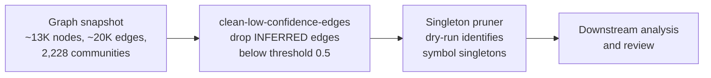

The NomikaiList knowledge graph is a codebase-derived graph that models symbols, relationships, and community structure across the NomikaiList project. It matters because it is the substrate for structural queries — dependency tracing, community detection, and cleanup of noisy or isolated nodes — and because its maintenance scripts operate on real, measured graph snapshots rather than on assumptions. This article covers the graph's scale, the edge-confidence filtering step, and the singleton pruning step, along with the order in which those operations apply.

## Graph scale and structure

The NomikaiList codebase graph is approximately 13K nodes and 20K edges, distributed across 2,228 communities [1][4]. The node count and the community count are the two figures that anchor most downstream reasoning: nodes represent code entities, edges represent relationships between them, and communities represent clusters of tightly connected entities. A graph of this size is large enough that manual inspection is impractical, which is why the tooling described below operates in bulk and reports counts rather than individual items.

A concrete snapshot illustrates the scale. On the 2026-05-04 graph, the measured totals were 12,984 nodes and 2,228 communities [3][6]. The community count in that snapshot matches the approximate figure reported for the graph overall, while the node count sits just under the 13K approximation [1][4]. This is consistent with a graph that grows incrementally as code is added, with the community structure remaining comparatively stable across the period covered by the evidence.

## Edge confidence filtering

Not every edge in the graph carries the same weight of evidence. The `clean-low-confidence-edges` script drops INFERRED edges that fall below a confidence threshold, and that threshold defaults to 0.5 [2][5]. Two properties of this behavior are worth noting.

First, the filter is scoped to INFERRED edges. Edges derived from other, presumably more direct, sources are not described as being subject to this threshold, so the script's effect is to remove low-confidence inferences rather than to prune the graph indiscriminately [2][5].

Second, the threshold is a parameter with a default rather than a hard-coded constant. The default of 0.5 defines the boundary between retained and dropped INFERRED edges when no override is supplied [2][5]. Raising or lowering it changes how aggressively inferred relationships are removed, which in turn changes the connectivity that later steps observe.

## Singleton pruning

After low-confidence edges are removed, some nodes may be left with no remaining connections. The singleton pruner addresses these. On the 2026-05-04 graph — 12,984 nodes and 2,228 communities — a dry-run of the singleton pruner identified 1,524 symbol singletons [3][6].

The dry-run framing matters: the reported figure of 1,524 is the output of an inspection pass, not the result of an applied deletion [3][6]. That makes the number useful as a measurement of how much isolated symbol material exists in the graph at that point in time, and it makes the pruner's effect reviewable before any change is committed. The count is also substantial relative to the 12,984-node total, which indicates that singleton symbols are a non-trivial fraction of the graph rather than an edge case.

## Pipeline flow

The two cleanup operations are ordered: confidence filtering runs first, and singleton detection runs against the resulting graph.

The ordering is what makes the singleton count meaningful. Because low-confidence INFERRED edges are dropped before singletons are counted, a node reported as a singleton is one that has no surviving connections under the configured threshold, not merely one whose only connections were weak inferences [2][5][3][6].

## See also

- Codebase graph construction
- Community detection
- Edge confidence thresholds
- INFERRED edge semantics
- Singleton and orphan node pruning
- Graph snapshot metrics

---

_Citations link to claims in evidence/claims/. Generated on 2026-09-21._
