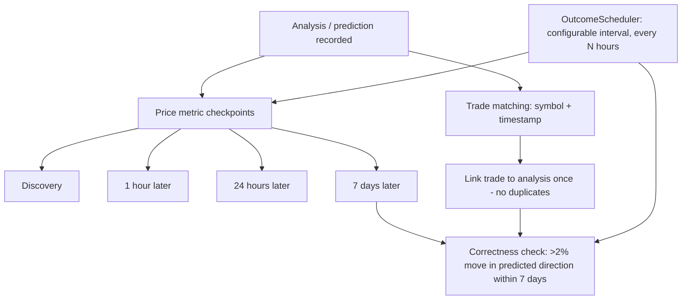

# Price Prediction Outcome Tracking

Price prediction outcome tracking is the part of the system that decides whether a published price prediction was correct and records the price evidence used to make that decision. It matters because a prediction is only useful if its result can be evaluated later against market data. Without a defined correctness rule, a fixed set of measurement points, and a reliable way to attach trades to the analyses that motivated them, outcome data is ambiguous and cannot be aggregated or audited.

## Correctness rule

A prediction is deemed correct if the price moved more than 2% in the predicted direction within 7 days [1][6]. This is a binary, threshold-based rule. The direction must match the prediction, the magnitude must exceed 2%, and the move must occur inside the 7-day window. A smaller move, a move in the opposite direction, or a move that happens after the window closes does not count as correct under this definition.

## Price metric checkpoints

To evaluate that rule, the system tracks key price metrics at specific intervals: discovery, 1 hour later, 24 hours later, and 7 days later [5][10]. These four checkpoints give a fixed observation schedule per prediction. The 7-day checkpoint corresponds to the window used by the correctness rule [1][5], while the earlier checkpoints — discovery, 1 hour, and 24 hours — capture short-horizon price behavior before the final evaluation.

## Linking trades to analyses

Outcome tracking depends on connecting executed trades back to the analyses that produced them. Trade matching relies on both the symbol and a timestamp [2][7]. Symbol alone would be ambiguous when the same instrument is traded repeatedly, so the timestamp disambiguates which trade corresponds to which analysis. The linking process between trades and analyses occurs only once to prevent duplicates [3][8]. This idempotency matters: if the same trade were linked on multiple passes, outcome counts would be inflated and per-analysis results would be double-counted.

## Scheduled updates

Updates are driven by the OutcomeScheduler, which runs updates at configurable intervals, including every N hours [4][9]. Because the checkpoints span from discovery out to 7 days, the scheduler is what advances predictions through their evaluation lifecycle without manual intervention. The interval is configurable, so the refresh frequency of outcome evaluation can be tuned independently of the checkpoint definitions themselves.

## Flow

The diagram shows the two inputs to an outcome: the price metric checkpoints and the linked trades. Both feed the correctness check, and the OutcomeScheduler drives the periodic refresh of each stage.

## See also

- Prediction correctness threshold
- Price metric checkpoints
- Trade-to-analysis linking
- OutcomeScheduler
- Duplicate prevention in outcome linking

---

_Citations link to claims in evidence/claims/. Generated on 2026-09-21._
