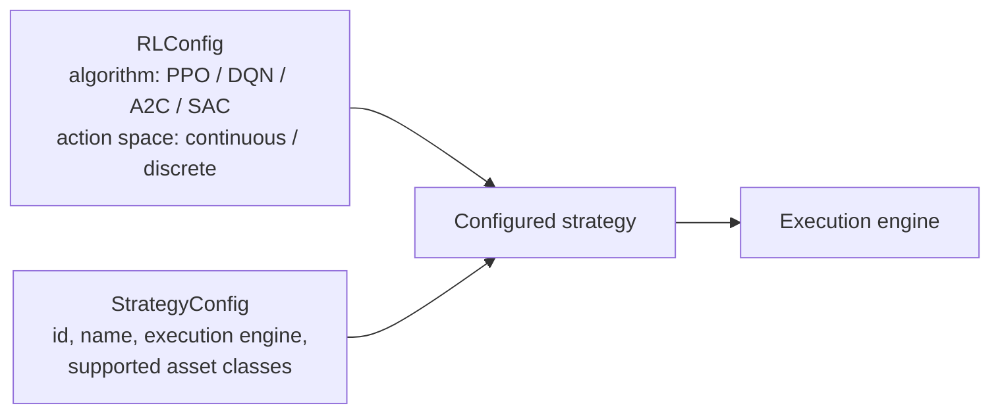

# RLConfig

`RLConfig` is the configuration object that describes a reinforcement learning agent in the alpaca system. It matters because it is the single place where the two decisions that most constrain an RL implementation — which algorithm to train and what shape the action space takes — are declared. Downstream components read those two fields rather than hard-coding assumptions, so the config object is the contract between the training code and the environment it runs against.

## Supported algorithms

`RLConfig` supports algorithms including PPO, DQN, A2C, and SAC [1][5]. That set is exposed as a single configurable field, which means a caller selects the training algorithm by name rather than by swapping out training code. The four algorithms are the full list given in the source material; anything outside it is not covered by the config schema as documented [1][5].

## Action spaces

`RLConfig` allows for continuous or discrete action spaces [1][5]. This is the second axis the object exposes, and it is declared alongside the algorithm choice. Because both fields live in the same object, the pairing of algorithm and action space is expressed in one place rather than being split across separate configuration files or environment definitions [1][5].

## Relationship to StrategyConfig

`RLConfig` does not stand alone. `StrategyConfig` is the main configuration object that defines a strategy, including its unique identifier, name, execution engine, and supported asset classes [2][6]. The two objects answer different questions: `StrategyConfig` carries identity and execution metadata — what the strategy is called, what runs it, and which assets it covers [2][6] — while `RLConfig` carries the learning metadata, namely the algorithm and the action space [1][5]. Keeping them separate means the same `RLConfig` can be reused across strategies that share an algorithm and action space but differ in identifier, engine, or asset coverage.

## Configuration-driven orchestration elsewhere

The same pattern — one declarative object driving a multi-stage process — appears on the ingestion side of the fabric. The unified ingestion pipeline runs as one command, `nomikai ingest run --mode batch|stream|refresh`, orchestrating Phases A–D: populate → extract → commit → validate [3][7]. The mode flag selects how the pipeline is driven, but the phase sequence itself is fixed by the pipeline rather than by the caller [3][7].

Cache freshness in that pipeline is tier-based: finished or cancelled media is cached for 90 days, currently airing or publishing media for 3 days, upcoming media for 14 days, and unknown or NULL values fall back to a 7-day default [4][8]. The tiering illustrates the general principle behind `RLConfig` as well: encode policy decisions as data in a config object and let the runtime read them, instead of scattering branches through the implementation.

## Practical notes

- Both fields exposed by `RLConfig` — algorithm and action space — should be treated as required, since they are the two axes the object documents [1][5].
- `RLConfig` and `StrategyConfig` are complementary, not alternatives: the strategy object carries identity and execution metadata [2][6], the RL object carries learning metadata [1][5].
- When extending the schema with a new algorithm, check it against the existing continuous/discrete action-space split before adding it [1][5].
- The ingestion pipeline and its cache tiers are useful reference points for how other parts of the fabric express policy as configuration [3][7][4][8].

## See also

- StrategyConfig
- Unified ingestion pipeline (`nomikai ingest run`)
- Cache freshness tiers
- PPO, DQN, A2C, SAC

---

_Citations link to claims in evidence/claims/. Generated on 2026-09-21._
