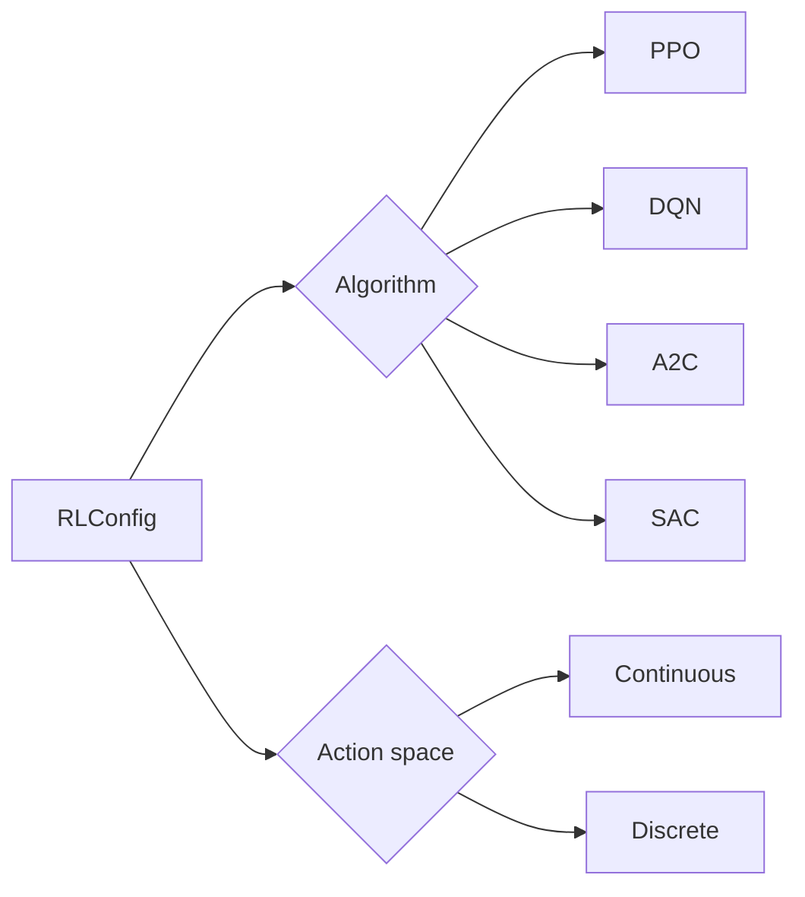
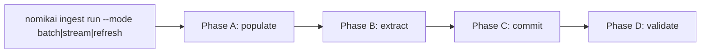

`RLConfig` is the configuration object that describes how a reinforcement learning run is set up. It is the point where an algorithm choice and an action-space choice are declared together, so that the rest of the training stack can read a single object instead of branching on scattered flags. Getting this object right matters because the algorithm and the action space are not independent: a run configured for discrete actions and a run configured for continuous actions exercise different code paths, and the config is where that decision is recorded.

## Algorithms and action spaces

`RLConfig` supports algorithms including PPO, DQN, A2C, and SAC, and allows for continuous or discrete action spaces [1][5]. That is the full extent of what the evidence states about the object: a set of four named algorithms and a binary action-space choice. There is no claim here about default values, hyperparameter fields, or validation rules, so those should not be assumed.

The practical consequence is that `RLConfig` is a selection surface rather than a tuning surface. A caller picks an algorithm from the supported set and declares whether the environment exposes continuous or discrete actions [1][5]. Everything downstream — policy construction, replay handling, update rules — is implied by that pair.

## Relationship to other configuration objects

`RLConfig` does not stand alone. The `StrategyConfig` is the main configuration object that defines a strategy, including its unique identifier, name, execution engine, and supported asset classes [2][6]. The two objects sit at different levels: `StrategyConfig` carries identity and routing metadata — an identifier, a human-readable name, an execution engine, and the asset classes the strategy may touch [2][6] — while `RLConfig` carries the learning-specific choices of algorithm and action space [1][5].

Keeping these separate means a strategy can be identified and routed by `StrategyConfig` without the learning details leaking into the identity layer, and the learning details can change without altering the strategy's identifier or supported asset classes [2][6].

## Data supply and freshness

Training and evaluation runs depend on data arriving through a defined path. The unified ingestion pipeline runs as one command, `nomikai ingest run --mode batch|stream|refresh`, orchestrating Phases A–D: populate, extract, commit, and validate [3][7]. The single-command form with three modes means the same pipeline definition covers bulk loads, streaming input, and refreshes, rather than three separate entry points [3][7].

How long ingested records remain usable is governed by tier-based cache freshness: finished or cancelled media is cached for 90 days, currently airing or publishing media for 3 days, upcoming media for 14 days, and unknown or NULL values fall back to a 7-day default [4][8]. The tiers reflect how quickly each category's underlying data is expected to change — a finished title is stable, a currently airing one is not [4][8]. Any run that reads from this cache inherits those expiry windows, so a stale read is a function of the tier the record falls into rather than of elapsed time alone [4][8].

## Summary

`RLConfig` is a small, explicit contract: four supported algorithms and a continuous-or-discrete action-space choice [1][5]. It is distinct from `StrategyConfig`, which owns identity, execution engine, and asset-class scope [2][6]. The data those runs consume arrives through a single ingestion command with batch, stream, and refresh modes covering four phases [3][7], and is retained according to tier-based freshness windows of 90, 3, 14, or 7 days depending on the record's status [4][8].

## See also

- `StrategyConfig` — strategy identity, execution engine, and supported asset classes [2][6]
- PPO, DQN, A2C, SAC — the algorithms `RLConfig` supports [1][5]
- Continuous and discrete action spaces [1][5]
- Unified ingestion pipeline (`nomikai ingest run`) and Phases A–D [3][7]
- Cache freshness tiers [4][8]

---

_Citations link to claims in evidence/claims/. Generated on 2026-09-21._
