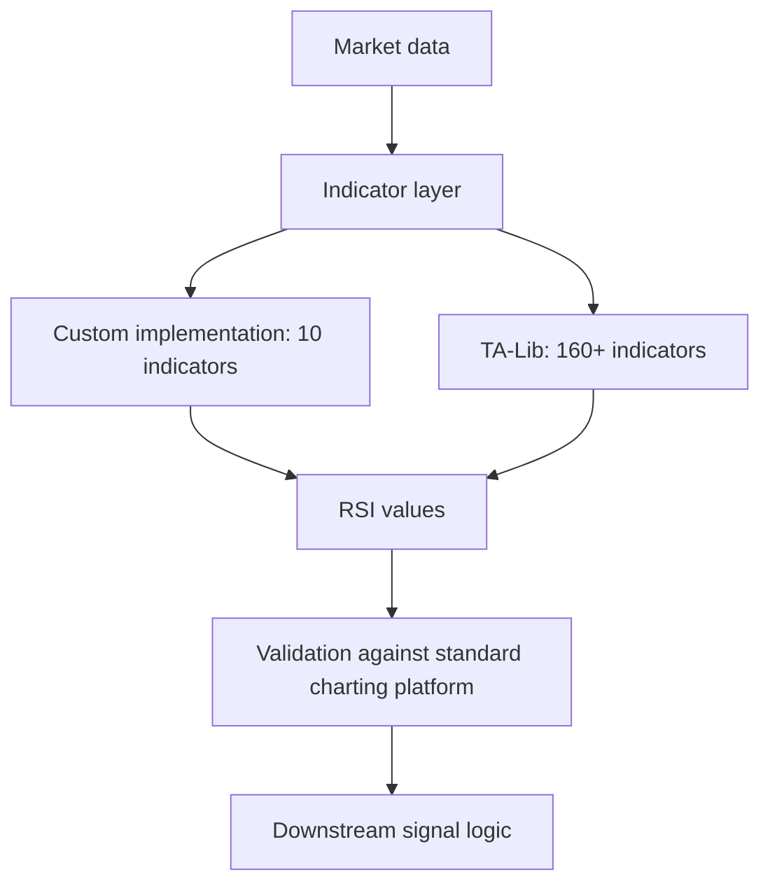

# RSI Implementation

This article covers how the Relative Strength Index (RSI) is implemented in the project's indicator layer, and what constrains that implementation. The available evidence documents the indicator layer as a whole rather than RSI-specific code, so the sections below describe the correctness and maintenance constraints that any RSI implementation in this codebase has to satisfy. The topic matters because RSI is consumed by downstream signal logic: if the indicator layer's statistical conventions diverge from what standard charting platforms produce, every value derived from it is suspect, and the divergence is invisible unless it is explicitly tested for.

## The custom indicator layer

The original indicator layer is a custom implementation covering 10 indicators [3][6]. That scope is the first constraint on RSI: whatever the layer does for one indicator, it tends to do for all of them, because the indicators share helper routines for rolling windows, smoothing, and aggregation.

Two documented defects in that layer illustrate the failure mode:

- **Bollinger Bands** is computed with the population standard deviation (`ddof=0`), which is inconsistent with standard charting platforms [1][4]. Charting platforms use the sample standard deviation (`ddof=1`) for this calculation, so the custom layer's bands are systematically narrower than the reference values.
- **VWAP** is computed cumulatively across the entire dataset, which is inappropriate for an intraday institutional benchmark [2][5]. An intraday VWAP is expected to reset at the session boundary; a cumulative series drifts further from the benchmark with every additional day of history.

Neither defect is an RSI bug, but both are evidence about the layer RSI lives in. The Bollinger case shows that the layer's statistical conventions were chosen without reference to platform behavior [1][4]. The VWAP case shows that the layer's windowing semantics were chosen without reference to the intended use of the indicator [2][5]. Any RSI implementation in this layer inherits the same review requirement: confirm the smoothing convention against a reference platform, and confirm the window is scoped to the period the indicator is meant to describe.

## Migration to TA-Lib

The alternative to fixing the custom layer indicator by indicator is to replace it. TA-Lib offers a significantly broader range of indicators — 160+ — compared to the original custom implementation's 10 [3][6]. For RSI specifically, that breadth matters less than the fact that TA-Lib is a widely used reference implementation: its output is what other tooling is calibrated against, which removes the class of divergence described above.

The trade-off is a dependency and a change in the layer's interface surface. The 10-indicator custom layer is small enough to audit by hand; a 160+ indicator library is not, so validation shifts from "read the code" to "compare outputs against a known-good platform on a fixed dataset."

## Implementation flow

The validation step is not optional. Both documented defects — the `ddof=0` Bollinger Bands [1][4] and the cumulative VWAP [2][5] — would have been caught by comparing layer output against a standard charting platform on the same input series. That comparison is the acceptance test for the RSI implementation regardless of which path is taken.

## Practical implications

1. **Pin the smoothing and window conventions before writing code.** The VWAP defect is a windowing error [2][5]; the Bollinger defect is a convention error [1][4]. RSI is exposed to both.
2. **Prefer the reference implementation where one exists.** TA-Lib's coverage [3][6] means RSI does not need to be hand-rolled, and a hand-rolled version carries the same audit burden as the rest of the custom layer.
3. **Test against a platform, not against intuition.** The two defects survived in the custom layer precisely because no such test existed [1][2][4][5].

## See also

- Bollinger Bands Implementation — standard deviation convention (`ddof`)
- VWAP Implementation — session-scoped vs. cumulative windowing
- TA-Lib Integration — indicator coverage and dependency trade-offs
- Indicator Validation — comparing layer output against standard charting platforms
- Custom Indicator Layer — the 10-indicator implementation being replaced

---

_Citations link to claims in evidence/claims/. Generated on 2026-09-21._
