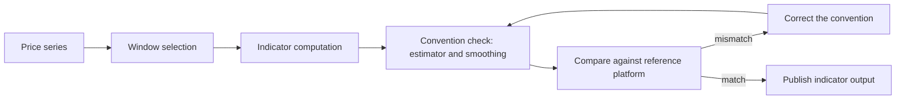

# RSI Implementation

RSI implementation covers how the Relative Strength Index is computed inside the custom indicator library, and how that computation is validated against the charting platforms it is compared to. It matters because indicator output is consumed directly by downstream signals: a windowing or statistical convention that differs from the reference platform produces different values for the same input series, and the divergence propagates silently rather than raising an error.

The evidence base for this article documents three implementation concerns in the same library — a statistical convention in Bollinger Bands, a windowing choice in VWAP, and the overall indicator coverage of the library. Each is a concrete instance of a defect class that applies equally to RSI, so they are treated here as the worked examples that define the acceptance criteria for an RSI implementation.

## Statistical conventions must match the reference platform

The Bollinger Bands calculation currently uses population standard deviation (ddof=0), which is inconsistent with standard charting platforms [1][4]. The problem is not that `ddof=0` is mathematically invalid; it is that it disagrees with the estimator convention used by the platforms against which output is compared. The result is a small, systematic offset that survives every test that only checks for plausibility.

The transferable rule for RSI is that every convention choice in the computation — lookback length, estimator, and any smoothing step — must be pinned to a named reference platform and asserted in a test. A convention that is merely documented is not pinned; it will drift the next time the code is touched.

## Windowed versus cumulative computation

The current implementation of VWAP is cumulative across the entire dataset, which is inappropriate for an intraday institutional benchmark [2][5]. The defect here is a scope error: the aggregation window does not match the window the benchmark is defined over, so the value becomes less meaningful as the dataset grows.

For RSI the same class of error appears as a choice between a rolling window and an expanding one. Whichever is selected, the window semantics must be explicit in the function signature and covered by a test that feeds a series long enough for the two behaviours to diverge. A cumulative implementation that happens to look correct on a short fixture will not look correct in production.

## Library coverage and build-versus-buy

TA-Lib offers a significantly broader range of indicators (160+) compared to the original custom implementation (10 indicators) [3][6]. That gap is the main argument for delegating indicator math to a maintained library rather than reimplementing each indicator by hand: every hand-written indicator is another opportunity for the convention and windowing defects described above.

The counter-argument is that a dependency does not remove the need for parity tests. A library call still has to be validated against the reference platform, because the library's conventions are its own. The practical split is to use the library for the computation and keep the custom code for windowing, alignment, and validation.

## Validation flow

The loop is the important part. A mismatch is not a one-time fix; it is a signal that the convention was never pinned, and the correction should be accompanied by a regression test that fails on the old behaviour.

## Summary

An RSI implementation is correct only relative to a stated reference. The three documented defects — the `ddof=0` Bollinger Bands convention [1][4], the cumulative VWAP window [2][5], and the narrow 10-indicator custom surface versus TA-Lib's 160+ [3][6] — all reduce to the same failure mode: an unstated assumption about scope or convention that no test enforced. Fixing the assumption and adding the test is the whole of the work.

## See also

- Bollinger Bands
- VWAP
- TA-Lib
- Indicator Library Coverage
- Standard Deviation Conventions
- Reference Platform Parity

---

_Citations link to claims in evidence/claims/. Generated on 2026-09-21._
