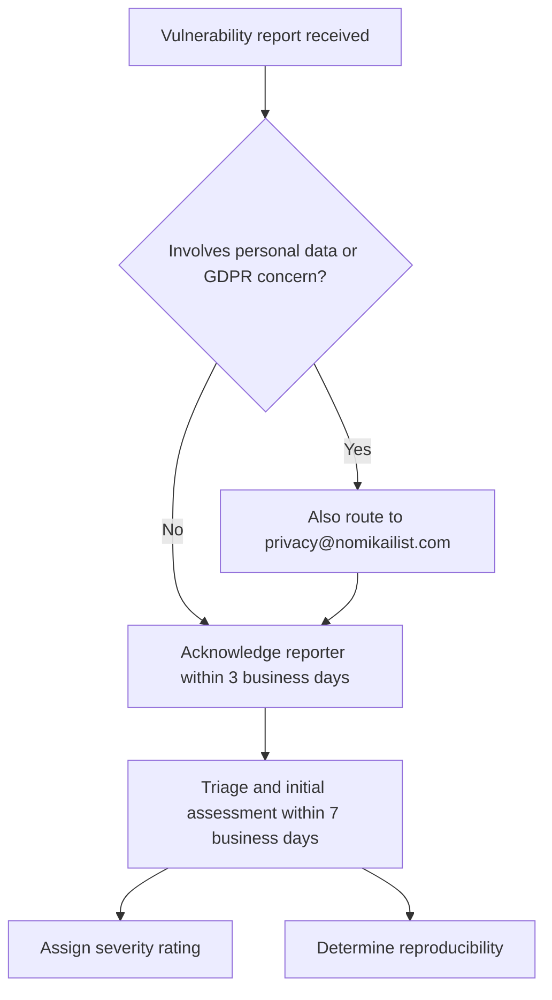

Security vulnerability management is the set of processes an organization uses to receive, acknowledge, triage, and track reports of security weaknesses in its systems. It matters because the window between a report arriving and someone qualified assessing it is where risk accumulates: an unacknowledged report may be published, resold, or exploited, and an untriaged report cannot be prioritized against other work. The evidence summarized here covers the intake and triage stages specifically — where reports go, how quickly they are acknowledged, and what the initial assessment is required to produce.

## Reporting Channels

A vulnerability management process begins with a defined intake path. Reports arrive through a reporting channel, and the process must specify what happens when a report touches regulated data rather than only code. Privacy/GDPR concerns involving personal data may additionally be reported to privacy@nomikailist.com [1][4].

The word "additionally" is load-bearing. A privacy-related report is not diverted away from the security channel; it can be routed in parallel to a dedicated privacy address so that data-protection obligations are handled by people equipped to assess them. This keeps two distinct questions separate: whether the system is exploitable, and whether personal data has been or could be affected. Both may be true of the same report, and neither answer substitutes for the other.

## Acknowledgement

Reporters receive acknowledgement within 3 business days [2][5].

This is a commitment about the reporter's experience, not about resolution. Acknowledgement confirms that the report arrived and has an owner. A short acknowledgement window is operationally useful because it keeps the reporter engaged with the organization rather than with a public disclosure forum or a broker. It also creates a timestamped record that the report was received, which matters if timelines are later questioned.

## Triage and Initial Assessment

Triage and initial assessment, including a severity rating and reproducibility determination, occur within 7 business days [3][6].

Two outputs are named explicitly, and both are required:

- **Severity rating** — a classification that lets the finding be compared against other findings and against other engineering work. Without a rating, triage produces a queue rather than a priority order.
- **Reproducibility determination** — a statement of whether the issue can be reproduced as described. This separates confirmed defects from reports that cannot be reproduced, which is a materially different state and should not be conflated with a confirmed vulnerability.

Note the ordering of the two clocks. Acknowledgement at 3 business days precedes triage at 7 business days, so the reporter hears back before the technical assessment is complete. These are distinct deadlines tracking distinct obligations, and a process that meets one does not thereby satisfy the other.

## Intake and triage flow

The diagram stops at the outputs of triage because that is where the cited evidence stops. Remediation, disclosure coordination, and closure are downstream of this scope and are not covered by the claims above.

## Operational implications

Three properties follow directly from the evidence. First, the process has two measurable clocks — 3 business days for acknowledgement [2][5] and 7 business days for triage [3][6] — which means both should be instrumented and reported separately. Second, privacy routing is additive rather than exclusive: a report involving personal data may go to privacy@nomikailist.com in addition to the normal channel [1][4]. Third, triage is defined by its artifacts, not by the meeting that produces them; a severity rating and a reproducibility determination are the deliverables [3][6].

## See also

- Coordinated vulnerability disclosure
- Severity rating and prioritization
- Reproducibility and proof-of-concept validation
- Privacy incident response and GDPR obligations
- Security incident response
- Vulnerability reporting policy and intake channels

---

_Citations link to claims in evidence/claims/. Generated on 2026-09-21._
