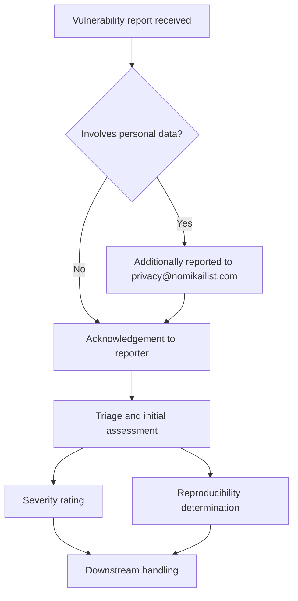

# Security Vulnerability Management

Security vulnerability management is the set of processes an organization uses to receive, acknowledge, assess, and act on reports of security defects in its systems. It matters because the interval between a report arriving and a team understanding it determines how long an exploitable issue stays unassessed. This article covers the intake and triage stages of that process: where reports go, how quickly they are acknowledged, and what the initial assessment is expected to produce.

## Reporting intake

Reports are submitted through a defined channel, and the process distinguishes between ordinary vulnerability reports and those that touch personal data. Privacy/GDPR concerns involving personal data may additionally be reported to privacy@nomikailist.com [1][4]. The word "additionally" is load-bearing: the privacy address is an extra destination, not a replacement for the security reporting channel, so a personal-data concern is visible to both tracks rather than being diverted away from the security process [1][4].

## Acknowledgement

Reporters receive acknowledgement within 3 business days [2][5]. This is the first commitment the process makes to an external reporter, and it is deliberately short. A reporter who receives acknowledgement knows the report has landed and is being handled, which reduces the incentive to resubmit it through another channel or disclose it elsewhere.

## Triage and initial assessment

Triage and initial assessment, including a severity rating and reproducibility determination, occur within 7 business days [3][6]. Two distinct outputs are named in that step:

- **Severity rating** — assigns the issue a position on a severity scale, which is what downstream prioritization consumes.
- **Reproducibility determination** — records whether the reported behavior can be triggered again under controlled conditions. A report that cannot be reproduced cannot be confirmed as a defect; a report that can be reproduced gives the team a concrete test case to work against.

The 7-business-day window covers the whole triage step, not just the severity rating [3][6]. Both the rating and the reproducibility determination are expected to be complete inside that window.

## Timelines at a glance

| Stage | Target |
| --- | --- |
| Acknowledgement to reporter | 3 business days [2][5] |
| Triage and initial assessment (severity rating, reproducibility determination) | 7 business days [3][6] |

## Process flow

## Why the timelines are split

The two windows are separate rather than merged. Acknowledgement is a fast, low-cost signal that requires no analysis; triage takes longer because a severity rating and a reproducibility determination cannot be produced without someone actually looking at the issue [2][3][5][6]. Keeping them apart means the reporter gets confirmation early without the team having to commit to a severity judgement before it has done the work.

The same separation applies to the privacy path. Because personal-data concerns can be reported to privacy@nomikailist.com in addition to the normal channel [1][4], the data-protection side of the organization sees those reports without the security triage step having to be re-routed or duplicated.

## See also

- Coordinated Vulnerability Disclosure
- Vulnerability Disclosure Policy
- Incident Response
- Severity Rating and Scoring
- Patch Management
- Data Protection and GDPR Compliance
- Security Reporting Channels

---

_Citations link to claims in evidence/claims/. Generated on 2026-09-21._
