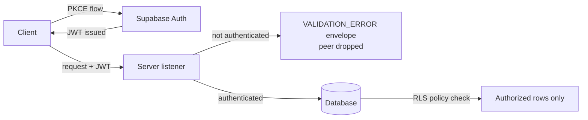

Supabase JWT token management covers how authentication credentials are issued, carried, and enforced across a Supabase-backed system. It matters because the token is the boundary between an anonymous peer and an authorized user: everything downstream — API access, database reads, and writes — depends on whether that boundary holds. Supabase Auth handles the issuance side, while the server listener and Row Level Security (RLS) policies handle enforcement at two separate layers.

## Token issuance: PKCE and JWT handled by Supabase Auth

Supabase Auth provides PKCE and JWT token management without requiring manual implementation [2][5]. In practice this means the authorization-code exchange and the resulting token lifecycle are delegated to the auth service rather than hand-rolled in application code. The engineering consequence is that the client does not need to construct, sign, or negotiate tokens itself; it completes the PKCE flow and receives a JWT that it then presents on subsequent requests [2][5].

Because this is provided rather than implemented, the correctness of the token format and the exchange protocol is not something the application team maintains. That reduces the surface area where a custom implementation could diverge from the expected contract.

## Enforcement at the server listener

The server listener is the first enforcement point. It refuses non-authenticated peers with a VALIDATION_ERROR-family envelope and drops them [1][4]. Two properties are worth noting here:

- **Rejection is explicit.** The peer receives a structured error in the VALIDATION_ERROR family rather than a silent failure or an ambiguous response [1][4].
- **Rejection is terminal.** The connection is dropped, not merely downgraded to a lower-privilege session [1][4].

This means an unauthenticated request never reaches application logic. The listener acts as a gate: either a peer presents credentials that satisfy the listener, or it is removed from the connection set entirely [1][4].

## Row Level Security as the data-layer backstop

Listener-level rejection protects the entry point, but it does not by itself constrain what an authenticated user can read or write. That is the role of RLS policies. RLS policies ensure that users can only access data they're authorized to see, preventing unauthorized data exposure even if application-level security is bypassed [3][6].

The phrase "even if application-level security is bypassed" is the important part. RLS is a defense-in-depth control: it assumes that a bug, a misrouted request, or a logic error above the database layer could let a request through with the wrong identity, and it constrains the result at the point where data is actually returned [3][6]. Authorization is therefore enforced twice — once at the listener, once at the row.

## Request flow

The diagram reflects the two independent checks: the listener decides whether the peer stays connected [1][4], and RLS decides which rows that peer can touch [3][6]. Supabase Auth supplies the credential that both checks depend on [2][5].

## Operational implications

Because token management is provided rather than built [2][5], the operational work shifts from implementing the flow to verifying that both enforcement layers are actually active. A listener that accepts unauthenticated peers, or a table without RLS policies, would each independently undermine the model — the first by admitting the wrong peer [1][4], the second by exposing rows to an authenticated peer who should not see them [3][6].

## See also

- Supabase Auth
- PKCE Authorization Flow
- JWT Validation at the Server Listener
- VALIDATION_ERROR Envelope
- Row Level Security (RLS) Policies
- Defense in Depth for API Authorization

---

_Citations link to claims in evidence/claims/. Generated on 2026-09-21._
