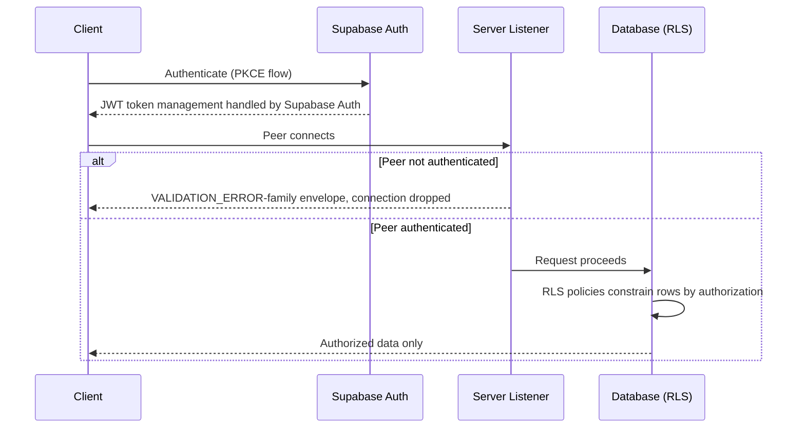

Supabase JWT token management covers how a Supabase-backed application obtains authentication tokens, carries them to a server, and has them validated — and how authorization is enforced once a token is accepted. It matters because token handling sits on the boundary between an anonymous request and an authorized one. Get it wrong in one direction and legitimate users are locked out; get it wrong in the other and data is exposed. Supabase Auth is built so that the token mechanics themselves — PKCE and JWT token management — are provided by the platform rather than implemented by hand [2][5].

## What Supabase Auth provides

Supabase Auth provides PKCE and JWT token management without manual implementation [2][5]. The practical consequence is that an application does not need to build its own authorization-code exchange or its own token lifecycle code; the auth service owns that path. For engineering teams this reduces the surface area where auth bugs can be introduced, because the flow is not reimplemented per project and does not drift between clients.

## Validating peers at the server listener

On the server side, the listener is the first enforcement point. The server listener refuses non-authenticated peers with a VALIDATION_ERROR-family envelope and drops them [1][4]. Two properties are worth noting. First, the rejection is explicit: the peer receives a structured error envelope in the VALIDATION_ERROR family rather than an ambiguous failure or a silent hang. Second, the connection is dropped rather than left open in an unauthenticated state. A peer that cannot authenticate does not proceed into application logic.

## Authorization at the data layer

Passing the listener is not the end of the check. RLS policies ensure that users can only access data they're authorized to see, preventing unauthorized data exposure even if application-level security is bypassed [3][6]. This is a defense-in-depth property: even if a request reaches the database through a path where application-level checks were skipped, misconfigured, or wrong, row-level security still constrains which rows are visible or writable for that identity.

## Flow

## Why the split matters

The two enforcement points cover different failure modes, and neither substitutes for the other. The listener answers the coarse question — is this peer authenticated at all — and terminates the connection when the answer is no [1][4]. RLS answers the fine question — which rows may this identity touch — and continues to hold even when application-level security is bypassed [3][6]. Because Supabase Auth supplies PKCE and JWT token management out of the box [2][5], the team's own code is not responsible for the token mechanics that feed both checks. That leaves the application responsible for the parts it can actually reason about: which policies exist, and what each identity is meant to reach.

## See also

- Supabase Auth
- Row Level Security (RLS) policies
- PKCE authorization flow
- JWT validation at service boundaries
- Defense in depth

---

_Citations link to claims in evidence/claims/. Generated on 2026-09-21._
