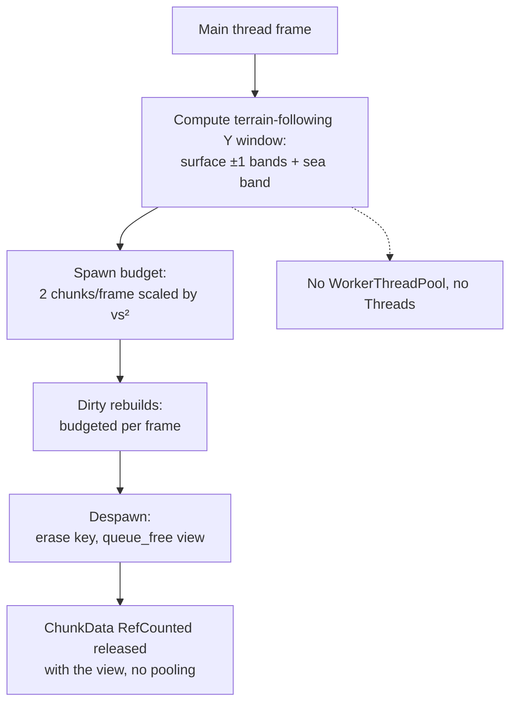

Synchronous main thread execution is the design constraint under which all chunk streaming work — spawning, rebuilding, and despawning — runs on the main thread inside the frame, with no worker threads or thread pool involved [2][5]. It matters because it determines where the frame budget goes, how memory is reclaimed, and what the debugger can actually observe. This article covers the streaming pipeline that operates under that constraint, the object lifecycle it implies, and the tooling limits that follow from it.

## What "Synchronous" Means Here

The streaming system is entirely synchronous on the main thread [2][5]. There is no `WorkerThreadPool` and no `Thread` instances in the pipeline [2][5]. Every unit of work — deciding which chunks should exist, building or rebuilding their data, and tearing them down — is executed inline during the frame rather than being dispatched to a background executor and joined later.

The practical consequence is that the cost of streaming is directly visible in frame time. There is no hidden concurrency to absorb spikes; the only control available is budgeting, which the system applies explicitly (see below).

## The Streaming Pipeline

Streaming selects chunks using a terrain-following Y window rather than a fixed vertical extent. The window consists of surface ±1 bands plus a sea band [2][5]. This keeps the active set tied to the terrain the player is actually near, instead of allocating a full column of chunks above and below.

Work is admitted to the frame under two separate budgets:

- **Spawning:** a budget of 2 chunks per frame, scaled by vs² [2][5].
- **Dirty rebuilds:** budgeted per frame [2][5].

Both budgets exist because the pipeline is synchronous. Since nothing runs off-thread, the only way to avoid a long frame is to cap how much of the pending work is consumed in any single frame and let the remainder wait for the next one.

## Despawn and Memory Lifetime

Despawn is equally direct. It erases the key from the tracking structure and calls `queue_free()` on the view [1][4]. The `ChunkData` is a `RefCounted` object that dies together with the view [1][4]. There is no pooling: freed chunks are not retained for reuse [1][4].

This means memory reclamation is tied to the view's lifetime rather than to a separate cache. A chunk that leaves the active set releases both its view and its data, and re-entering that region later pays the full allocation and build cost again. Combined with the per-frame rebuild budget, this keeps the steady-state memory footprint bounded by the active window, at the cost of repeated construction work.

## Debugging and Tooling Constraints

The synchronous design aligns with the supported debugging configuration: async and multi-threaded stacks are not supported, and only the main thread is debugged [3][6]. Because all streaming work executes on the main thread [2][5], it falls inside the region the debugger covers. There is no need to reason about breakpoints in worker threads, cross-thread state, or stacks that the tooling cannot walk.

The trade-off is that any future move to threaded streaming would fall outside the currently supported debugging envelope [3][6], so the synchronous constraint is not merely an implementation detail — it is coupled to what the toolchain can inspect.

## Implications

Three properties follow from the evidence above:

1. **Frame cost is explicit.** Spawn and rebuild work is capped per frame [2][5], so the pipeline's worst case is a function of the budgets rather than of thread scheduling.
2. **Memory is not amortized.** No pooling means each chunk's `ChunkData` and view are created and destroyed with the chunk's presence in the window [1][4].
3. **Observability is complete.** Everything runs where the debugger looks [3][6], which is consistent with the main-thread-only execution model [2][5].

## See also

- Chunk Streaming
- Terrain-Following Y Window
- Per-Frame Spawn Budget
- Dirty Rebuild Budgeting
- `queue_free()` and View Lifetime
- `RefCounted` Ownership
- Chunk Pooling (not used in this design)
- `WorkerThreadPool` and `Thread` (not used in this design)
- Main Thread Debugging

---

_Citations link to claims in evidence/claims/. Generated on 2026-09-21._
