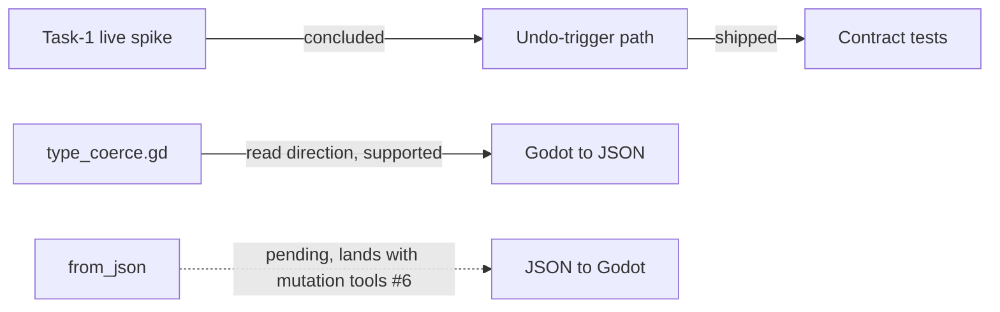

# Task-1 Live Spike

This article covers the outcome of the Task-1 live spike and the state of the code that came out of it. The spike is the point where the design questions for Task-1 were answered against a running system rather than on paper, so its conclusion is what unblocks the follow-on work: the undo-trigger path, the serialization boundary in `type_coerce.gd`, and the verification baseline that later changes are measured against. Anyone touching Task-1 code needs to know that the spike is closed, which direction the type coercion layer currently supports, and what the test and lint suites reported at that point.

## Spike status and the undo-trigger path

The Task-1 live spike concluded long ago, and the undo-trigger path has shipped and is contract-tested [1][4]. Two things follow from that. First, the spike is not an open investigation — it is historical context, and work that treats it as still in progress is working from a stale premise. Second, the undo-trigger path is not a prototype: it is shipped code with contract coverage, meaning its interface is pinned by tests rather than by convention. Contract tests are the relevant kind of coverage here because the undo trigger is a boundary between components; a contract suite asserts the shape of that boundary, so a change that breaks the trigger's callers fails in CI rather than at runtime.

## Serialization direction in `type_coerce.gd`

The `type_coerce.gd:9` class docstring states the read direction (Godot → JSON) is the only direction for now, and that `from_json()` lands with the mutation tools (#6) [2][5]. This is a deliberate scope boundary, not an oversight. The coercion layer currently converts Godot values into JSON-compatible values; the inverse conversion is deferred and tied to a specific piece of work, the mutation tools tracked as #6. Practically, this means:

- Code that only reads and serializes Godot state can rely on `type_coerce.gd` today.
- Code that needs to reconstruct Godot values from JSON cannot use this layer yet, because `from_json()` does not exist.
- The dependency is explicit: the write direction arrives with the mutation tools, so scheduling that work also schedules the second half of the coercion layer.

The flow across the two areas looks like this:

The solid path is what exists now; the dashed path is what is explicitly deferred.

## Verification baseline

Contract and unit suites reported 781 passed with zero skips, and ruff plus mypy were clean [3][6]. Three details matter more than the headline number. The suites are both contract and unit, so the boundary-level and function-level checks were run together. Zero skips means no test was silently disabled or conditionally bypassed — the 781 figure reflects tests that actually executed. And clean ruff plus mypy runs mean the static checks, lint and type checking respectively, raised no findings, so the type annotations in the codebase were consistent at that point.

Taken together, the spike's conclusion, the shipped undo-trigger path, the documented one-way coercion boundary, and the clean verification run describe a stable checkpoint. The open item is the write direction of `type_coerce.gd`, which is gated on the mutation tools (#6) rather than on any unresolved question from the spike itself.

## See also

- Undo-trigger path
- Contract testing
- `type_coerce.gd` and the type coercion layer
- Mutation tools (#6)
- `from_json()` and the JSON → Godot direction
- Static analysis: ruff and mypy

---

_Citations link to claims in evidence/claims/. Generated on 2026-09-21._
