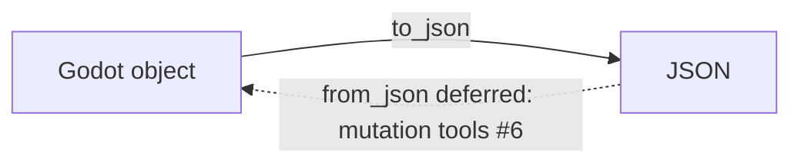

# Task-1 Live Spike

This article covers the Task-1 live spike: what it set out to de-risk, what it produced, and what state the resulting code is in today. It matters because the spike is the origin point for the undo-trigger path and for the serialization boundary in `type_coerce.gd`. Anyone touching either area needs to know that the spike is closed, that the undo-trigger path is no longer experimental, and that one half of the serialization boundary is deliberately unimplemented.

## Spike status

The Task-1 live spike concluded long ago, and the undo-trigger path has shipped and is contract-tested [1][4]. The practical consequence is that the spike should not be treated as open work or as a source of pending decisions. The exploratory phase is over; the output of that phase is now production code with contract coverage behind it. If you find references to the spike as an active investigation, they are stale.

## The undo-trigger path

The undo-trigger path is the concrete deliverable that came out of the spike. It has shipped, and it is covered by contract tests rather than only by ad hoc manual checks [1][4]. Contract tests are the relevant category here because the path crosses a boundary — the trigger is exercised against a defined interface, so regressions in the interface surface are caught rather than discovered later.

## Serialization direction in `type_coerce.gd`

The class docstring at `type_coerce.gd:9` states that the read direction (Godot → JSON) is the only direction for now, and that `from_json()` lands with the mutation tools (#6) [2][5]. This is a deliberate scope boundary, not an oversight. The read direction is implemented and usable; the write direction is deferred and tied to a specific downstream work item.

The solid edge is the supported path today. The dashed edge is the deferred path, gated on the mutation tools tracked as #6 [2][5]. Code that assumes round-tripping through `type_coerce.gd` will not work until that item lands.

## Verification status

The contract and unit suites reported 781 passed with zero skips, and both ruff and mypy were clean [3][6]. Two things are worth noting about that result. First, zero skips means the suite is not silently passing over unexercised cases — the 781 figure reflects tests that actually ran. Second, clean ruff and mypy runs mean the static checks were not waived or suppressed for this work. Together these give a reasonably strong signal that the shipped undo-trigger path and the read-direction serialization code are in a consistent, checked state.

## What this means in practice

- The spike is closed; do not reopen it as an investigation [1][4].
- The undo-trigger path is shipped and contract-tested, so changes to it should go through the contract suite [1][4].
- `type_coerce.gd` supports Godot → JSON only; `from_json()` is deferred to the mutation tools (#6) [2][5].
- The current baseline is 781 passing tests with zero skips, clean ruff, and clean mypy [3][6].

## See also

- Undo-trigger path
- `type_coerce.gd` serialization boundary
- Mutation tools (#6)
- Contract testing
- Static analysis gates (ruff, mypy)

---

_Citations link to claims in evidence/claims/. Generated on 2026-09-21._
