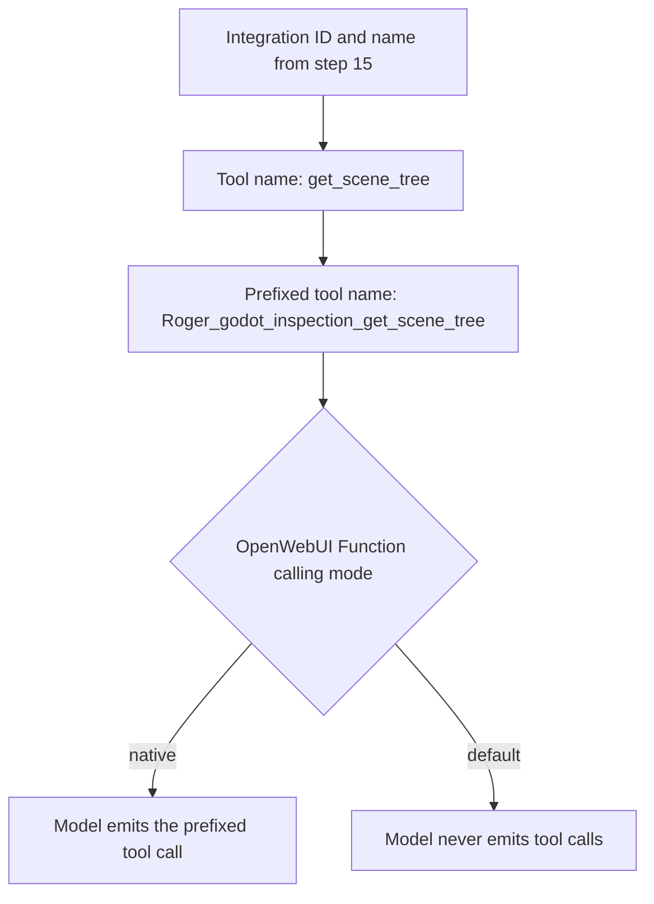

# Tool-Name Prefixing

Tool-name prefixing is the practice of prepending an integration's identifier and name to the name of each tool that integration exposes, so that an emitted tool call carries the integration identity alongside the tool's own name. It matters because the tool name is the only handle the model has when it emits a call: the host has to be able to tell which integration a call belongs to, and the name is where that information lives. In the Godot integration work described here, the LLM prefixed tool names with the integration ID and name from step 15, producing names such as `Roger_godot_inspection_get_scene_tree` [1][4].

## What the prefix contains

The observed name is a concatenation of the integration ID, the integration name, and the tool's own name. In `Roger_godot_inspection_get_scene_tree`, the integration ID and name appear ahead of the tool name `get_scene_tree` [1][4]. The prefix is therefore not a cosmetic label — it is the part of the string that identifies the integration the tool belongs to, carried on the same token the model emits.

## Where prefixing happens in the call path

Prefixing is applied at the point where the model emits a tool call, not in the tool's own definition. Change #168 added a lightweight `godot_inspection_get_scene_tree` mode, and that change is described using the unprefixed tool name [3][6]. The prefixed form appears only in the emitted call [1][4]. Keeping the two separate means the tool can be defined, documented, and versioned under its short name while the wire format carries the fully qualified one.

## Interaction with function calling mode

Prefixing is only observable if the model emits tool calls at all. Setting Function calling to `native` in OpenWebUI is the key toggle, because in `default` mode the model never emits tool calls — which is why the first three models appeared broken [2][5]. A prefixed name that never reaches the wire is indistinguishable from a missing tool, so any investigation of prefixing has to start by confirming that the function calling mode is `native` [2][5].

## Flow

The diagram shows the two gates a prefixed name passes through: the prefix is constructed from the integration ID and name [1][4], and the resulting call is only emitted when function calling is set to `native` [2][5].

## Practical implications

- The emitted name is longer than the tool's own name, and the model must reproduce the full prefixed string exactly [1][4].
- The unprefixed name remains the identifier used in change descriptions and tool definitions, as in change #168's `godot_inspection_get_scene_tree` mode [3][6].
- Debugging order matters: confirm `native` function calling first [2][5], then inspect the emitted name for the integration prefix [1][4]. Reversing the order leads to chasing a naming problem that is actually a mode problem.

## See also

- Function Calling Mode (OpenWebUI)
- Integration ID and Name
- Tool Namespacing
- Godot Inspection Integration
- Change #168

---

_Citations link to claims in evidence/claims/. Generated on 2026-09-21._
