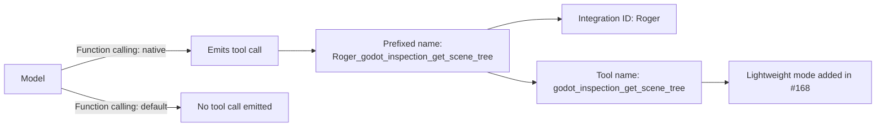

# Tool-Name Prefixing

Tool-name prefixing is the convention by which a model emits a tool call whose name is qualified with both an integration ID and the tool's own name, rather than the bare tool name. In the observed case, the LLM prefixed tool names with the integration ID and name from step 15, producing names such as `Roger_godot_inspection_get_scene_tree` [1][4]. The topic matters because everything downstream — routing, dispatch, logging, and debugging — keys off the exact string the model emits. When the emitted name does not match what the runtime expects, or when no name is emitted at all, the failure presents as a broken model rather than as a naming or configuration problem.

## Anatomy of a prefixed name

The prefixed form carries two pieces of information in a single string: the integration ID and the tool name. In `Roger_godot_inspection_get_scene_tree`, `Roger` is the integration ID and `godot_inspection_get_scene_tree` is the tool name [1][4]. The prefix is produced by the model as part of the tool call itself, not appended by a post-processing layer, so the exact spelling is whatever the model was given in its tool definitions. That makes the prefixed string an interface contract rather than an internal detail.

## Why the calling mode gates everything

Prefixing is only observable when the model actually emits tool calls. Setting Function calling to `native` is the key OpenWebUI toggle, because in `default` mode the model never emits tool calls — which is why the first three models appeared broken [2][5]. This is the diagnostic trap: a model that never emits a tool call produces no prefixed names, no routing attempts, and no error messages about names. The symptom is silence, and the cause is the calling mode, not the model's capability. Any investigation into prefixing therefore has to confirm the calling mode before it can conclude anything about naming.

## Naming changes and lightweight modes

Tool names are not static. Change #168 added a lightweight `godot_inspection_get_scene_tree` mode [3][6]. Because the tool name is embedded inside the prefixed string, any change to the tool's name or mode changes the string the model must emit, and therefore changes what the runtime must match against. Renames and mode additions are naming events, not just implementation details, and they need to be tracked as such.

## Flow

The diagram shows the two branches that matter operationally. On the `native` branch, the model emits a call and the prefixed name becomes visible and routable. On the `default` branch, nothing is emitted, so no prefix ever appears and the failure looks like a model defect [2][5].

## Practical implications

- **Check the calling mode first.** If no tool calls appear, verify that Function calling is set to `native` before investigating the model itself [2][5].
- **Treat the prefixed string as an interface.** Both the integration ID and the tool name are part of the contract the model must reproduce exactly [1][4].
- **Track renames and mode additions.** A change such as #168 alters the tool name that appears inside the prefix, which changes what the runtime must match [3][6].

## See also

- Function calling modes (`native` vs `default`)
- Integration IDs
- Tool call routing and dispatch
- `godot_inspection_get_scene_tree`
- OpenWebUI configuration

---

_Citations link to claims in evidence/claims/. Generated on 2026-09-21._
