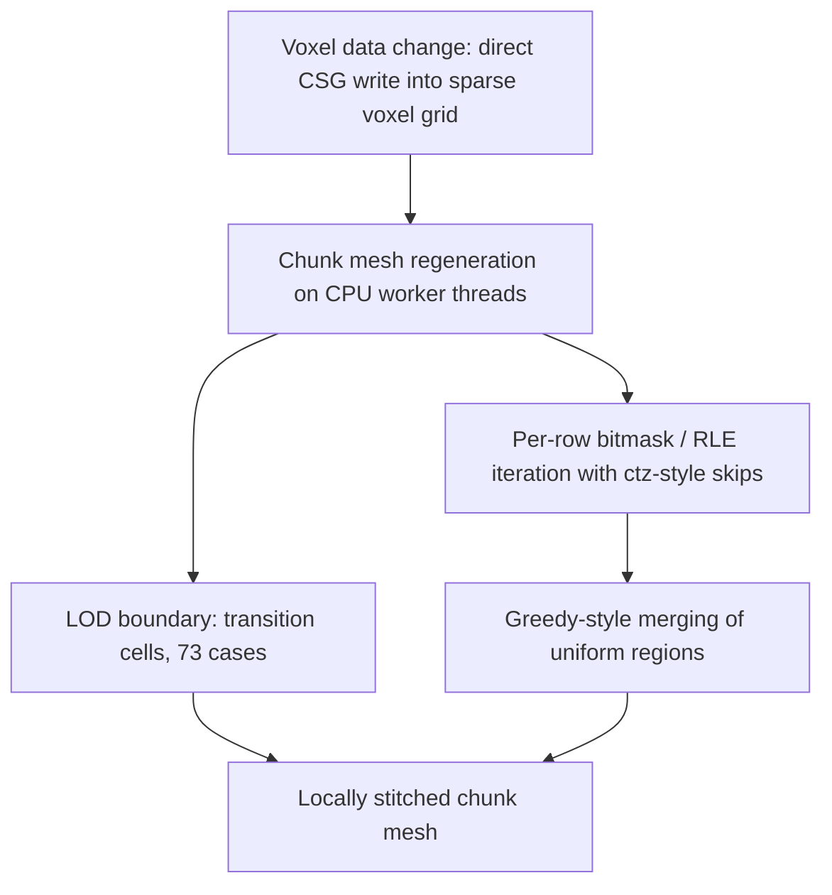

# Transvoxel LOD

Transvoxel LOD covers how voxel chunk meshes generated at different levels of detail are stitched together at their shared boundaries, and how that stitching is kept cheap enough to run while voxel data is still changing. It matters because a real-time destructible voxel world cannot afford a global remesh every time geometry is edited: the LOD seam is the part of the pipeline that needs an explicit, bounded solution rather than a special case bolted onto the mesher.

## The LOD seam problem

When two neighbouring chunks are meshed at different resolutions, their shared boundary does not line up vertex-for-vertex. Transvoxel's transition cells make LOD-boundary stitching local (73 cases) and are explicitly designed for fast retriangulation when voxel data changes in real time [3][6]. The word *local* is the load-bearing part: the reconciliation work is confined to the boundary cells, so a resolution change does not force a rebuild of the interior of either chunk. The case set is finite and enumerable — 73 cases [3][6] — which is what allows the boundary decision to be resolved per cell rather than derived from the surrounding mesh.

## Remeshing in practice: Teardown

Teardown is a custom engine using a sparse voxel grid with material data, direct voxel CSG writes for destruction, and chunk meshes regenerated on CPU worker threads (not GPU) with greedy-style merging [1][4]. Two properties of that design interact directly with LOD stitching. First, destruction is expressed as CSG writes into the grid, so an edit invalidates voxel data rather than a mesh, and the mesh must be rebuilt from the grid. Second, that rebuild happens on CPU worker threads, not the GPU [1][4], which means the transition-cell work lands on the same threads that do ordinary chunk remeshing. This is exactly the workload Transvoxel's transition cells were designed for: fast retriangulation when voxel data changes in real time [3][6].

## Keeping per-chunk cost down

Iterating sub-voxels via per-row bitmasks/RLE with ctz-style skips makes uniform blocks cost O(1) instead of vs³ [2][5]. Uniform blocks are the case a naive traversal handles worst — a full cubic scan per block — and the per-row bitmask/RLE approach with ctz-style skips collapses that to a constant [2][5]. This complements greedy-style merging [1][4]: merging reduces the number of output triangles, while the bitmask/RLE iteration reduces the number of input sub-voxels actually visited. Together they keep the CPU worker threads from becoming the bottleneck when many chunks are dirty at once.

## Pipeline

The diagram reflects the split of responsibilities: the interior of a chunk is handled by iteration and merging, while the boundary is handled by transition cells, and both feed the same regenerated chunk mesh.

## Practical takeaways

- LOD stitching is local to boundary cells, not a global pass [3][6].
- The transition-cell case set is finite: 73 cases [3][6].
- The design goal is fast retriangulation under real-time voxel data change [3][6].
- Remeshing runs on CPU worker threads, not the GPU [1][4].
- Uniform blocks cost O(1) under per-row bitmask/RLE iteration with ctz-style skips, versus vs³ naively [2][5].
- Greedy-style merging and bitmask/RLE iteration attack different halves of the cost [1][4][2][5].

## See also

- Sparse voxel grid
- Greedy meshing
- Constructive solid geometry (CSG)
- Chunked voxel terrain
- Level of detail (LOD)
- Run-length encoding and bitmask iteration
- CPU worker-thread mesh generation

---

_Citations link to claims in evidence/claims/. Generated on 2026-09-21._
