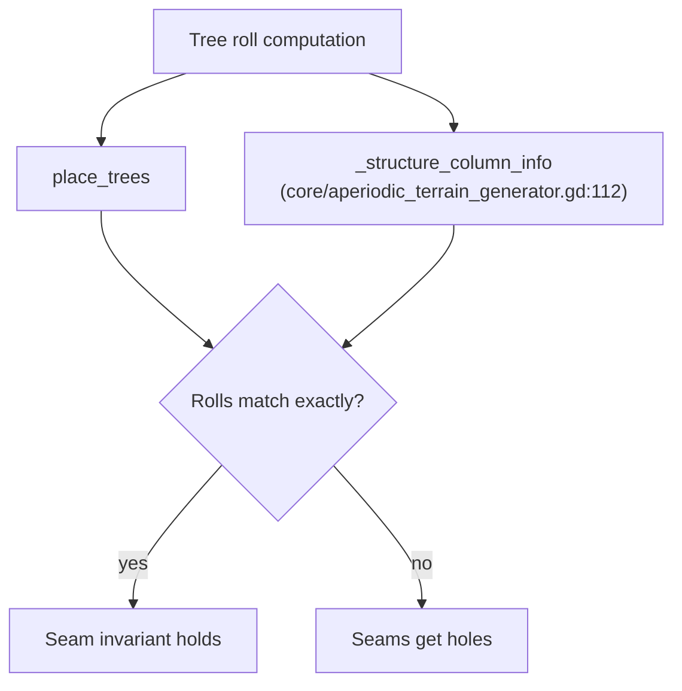

Tree roll duplication is the practice, in the aperiodic terrain generator, of computing the same tree-placement roll in two separate code paths. It matters because the two computations must agree exactly: if they diverge, chunk seams develop holes where trees should be. This article covers where the duplication lives, why the warning comment around it exists, and what the current test coverage does and does not prove about it.

## The duplicated roll

The tree roll is duplicated in `_structure_column_info` at `core/aperiodic_terrain_generator.gd:112` [3][6]. The code carries a comment warning that this roll must mirror `place_trees` "EXACTLY" or seams get holes [3][6]. That comment is the core constraint of the topic: two independent computations of the same value are kept in sync by convention and comment rather than by a shared function, and the failure mode when they drift is visible geometry — holes at chunk boundaries.

The duplication is not incidental. `place_trees` and `_structure_column_info` both need the same roll result, and the seam invariant depends on both producing identical output for the same column. Any change to one path that is not mirrored in the other breaks that invariant.

## The test coverage gap

The commit message for `ae7715b` claimed "2560/2560 agreement" [1][4]. That claim does not cover the aperiodic path: the seam test only runs the plain generator with no profile, so the aperiodic path is untested by that test [1][4]. In other words, the headline number in the commit message describes a run that never exercises the duplicated roll in the aperiodic configuration. The agreement figure is real for what it measures, but it is not evidence that the two tree-roll computations stay in sync under a profile.

This is the central risk of the duplication: the code path most likely to break the "EXACTLY" requirement is the one the seam test does not run [1][4].

## Geometry-culling checks

Separately, all 14 geometry-culling checks pass, including the new aperiodic seam invariant at 2304/2304 [2][5]. This is a different check set from the seam test discussed above, and it does exercise an aperiodic seam invariant. The two results should be read together rather than conflated: the geometry-culling suite reports a passing aperiodic seam invariant [2][5], while the seam test cited in the `ae7715b` commit message runs only the plain generator with no profile [1][4].

The practical reading is that the aperiodic seam invariant has a passing check in the geometry-culling suite, but the "2560/2560 agreement" claim in the commit message is not the evidence for it. Anyone auditing the tree-roll duplication should look at the geometry-culling results for the aperiodic case and treat the plain-generator seam test as covering a different configuration.

## Why this matters

The duplication in `_structure_column_info` is guarded only by a comment demanding an exact mirror of `place_trees` [3][6]. There is no shared helper enforcing that mirror, so correctness depends on every future edit to either path being applied to both. The failure mode is not a crash or a wrong number in a log; it is holes at seams. Given that the commit message's agreement figure comes from a test that does not run the aperiodic path [1][4], the strongest available evidence for the aperiodic case is the geometry-culling suite's 2304/2304 seam invariant [2][5].

## See also

- Aperiodic terrain generation
- Seam invariants
- Geometry culling checks
- `place_trees`
- `_structure_column_info`
- Chunk seam holes

---

_Citations link to claims in evidence/claims/. Generated on 2026-09-21._
