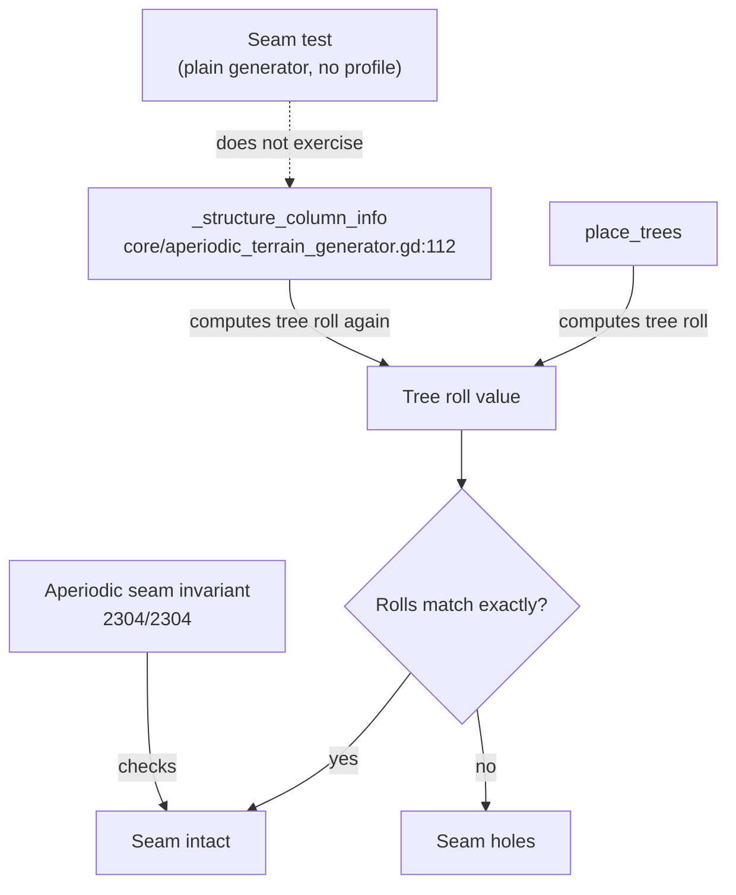

# Tree Roll Duplication

Tree roll duplication is the practice, in the aperiodic terrain generator, of computing the tree placement roll in two separate places: once in `place_trees` and again in `_structure_column_info` (core/aperiodic_terrain_generator.gd:112) [3][6]. The duplication matters because the two computations are required to agree exactly — if they drift apart, terrain seams develop holes [3][6]. This article covers where the duplication lives, why the mirroring constraint exists, and what the current test coverage does and does not verify.

## Where the duplication lives

The tree roll is duplicated in `_structure_column_info` at core/aperiodic_terrain_generator.gd:112 [3][6]. The code at that site carries a comment warning that the roll must mirror `place_trees` "EXACTLY" or seams get holes [3][6]. The comment is the only mechanism enforcing the constraint at the source level: there is no shared helper described in the evidence, so the two call sites are independent implementations that must be kept in sync by hand.

## Why the mirroring constraint exists

Structure column info and actual tree placement are consumed by different parts of the generation pipeline. If `_structure_column_info` derives a different roll than `place_trees` for the same column, the structure metadata and the placed geometry disagree about whether a tree occupies that column. At a chunk boundary, that disagreement shows up as a hole in the seam [3][6]. The "EXACTLY" wording in the comment reflects that even a small divergence in the roll computation is enough to break the invariant.

## Test coverage: the 2560/2560 claim

The commit message for ae7715b claimed "2560/2560 agreement" [1][4]. That figure does not cover the duplicated code path. The seam test only runs the plain generator with no profile, so the aperiodic path is untested [1][4]. In other words, the agreement number was produced by a test configuration that never exercises `_structure_column_info` in its aperiodic form, which is precisely where the duplication and its mirroring requirement live [1][4].

## Geometry-culling checks

Separately from the seam test, all 14 geometry-culling checks pass, including the new aperiodic seam invariant (2304/2304) [2][5]. This is a distinct check from the plain-generator seam test described above, and it does exercise the aperiodic path. The two results should not be conflated: the 2304/2304 aperiodic seam invariant is a passing geometry-culling check [2][5], while the 2560/2560 agreement figure comes from a test that does not run the aperiodic path at all [1][4].

## Flow of the duplicated roll

The diagram shows the two independent roll computations feeding a single comparison. The dashed edge marks the coverage gap: the seam test that produced the 2560/2560 agreement figure does not reach the aperiodic `_structure_column_info` path [1][4]. The aperiodic seam invariant, part of the 14 passing geometry-culling checks, does check the seam outcome [2][5].

## Practical implications

Two things follow from the evidence. First, the mirroring requirement between `place_trees` and `_structure_column_info` is documented only by an inline comment, so any change to one roll computation must be manually reflected in the other [3][6]. Second, the "2560/2560 agreement" claim in the ae7715b commit message should not be read as validation of the aperiodic path, because the seam test that produced it runs the plain generator with no profile [1][4]. The aperiodic seam invariant at 2304/2304 is the check that covers that path [2][5].

## See also

- Aperiodic terrain generation
- Seam invariants
- Geometry culling
- `place_trees`
- `_structure_column_info`
- Plain generator vs. profiled generator test configurations

---

_Citations link to claims in evidence/claims/. Generated on 2026-09-21._
