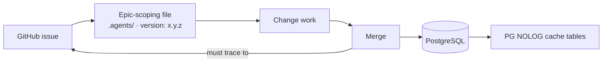

Versioning in this knowledge fabric is not a single mechanism but a set of constraints that apply at three different layers: the header metadata on epic-scoping files, the traceability rules that govern merges, and the storage layer that holds the resulting state. The topic matters because each layer answers a different question — *what revision is this artifact?*, *what change authorized it?*, and *what does the system persist?* — and a pipeline that answers only one of them cannot reconstruct its own history.

## Version fields on epic-scoping files

Epic-scoping files under `.agents/` carry a `version: x.y.z` field in their header comment [2][5]. This is the most literal form of versioning in the system: the artifact declares its own revision inline, in the same place a reader would look for any other file metadata. Because the field lives in the header comment rather than in a separate manifest, the version travels with the file itself — a copy of the file is a copy of its version, with no side lookup required.

The `x.y.z` shape implies the usual three-part reading: a major component for incompatible restructuring of the epic scope, a minor component for additive change, and a patch component for corrections that do not alter the scope's meaning. The evidence establishes the field and its format; it does not prescribe who bumps it or when, so any bump policy is a local convention layered on top of the field rather than something the field itself enforces.

## Merge traceability

Every merge in the issue-driven pipeline must trace to a GitHub issue [1][4]. This is versioning expressed as provenance rather than as a number. A version field tells you *which* revision you are looking at; issue traceability tells you *why* that revision exists and what discussion produced it. The two are complementary: the `version: x.y.z` header identifies the artifact state, and the linked issue identifies the intent behind the transition into that state.

The practical consequence is that a merge with no issue behind it is not merely untidy — it is unversionable in this pipeline's sense, because there is no anchor to attach the change to. Reviewers, auditors, and future maintainers all resolve a merge by walking back to its issue, and that walk is only possible if the link is mandatory rather than optional.

## Storage-layer constraints

The database support is PostgreSQL only — Supabase or raw postgres — with no Redis and no external caches; caching instead happens via PG NOLOG tables per Article X [3][6]. For versioning, this constraint is significant because it removes a class of divergence. When cache state lives outside the database, the cache and the durable store can drift, and a reader has to reason about which of the two is authoritative for a given revision. Keeping caching inside PostgreSQL via NOLOG tables means the cached representation and the persisted representation share one engine, one transaction boundary, and one backup story.

The constraint also narrows the operational surface: there is no second datastore to version, migrate, or reconcile. Whatever versioning discipline the pipeline applies to its data applies in exactly one place.

## How the layers fit together

Read together, the three constraints describe a pipeline where an issue authorizes a change [1][4], the change lands in an epic-scoping file that declares its own `version: x.y.z` [2][5], and the resulting state is persisted in PostgreSQL with in-database caching rather than an external tier [3][6]. Version identity, change provenance, and storage are handled by separate mechanisms, each with a single obvious place to look.

## See also

- Issue-driven pipeline
- Epic-scoping files under `.agents/`
- Merge traceability and provenance
- PostgreSQL-only storage policy
- PG NOLOG cache tables (Article X)

---

_Citations link to claims in evidence/claims/. Generated on 2026-09-21._
