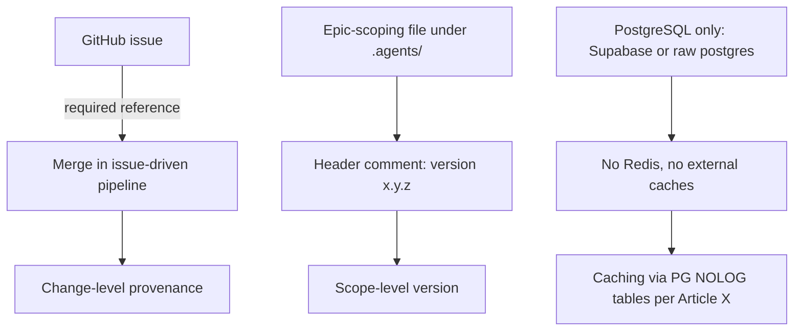

# Versioning

Versioning in this knowledge fabric covers two distinct surfaces: the explicit version field carried by epic-scoping files, and the traceability rules that make every change in the issue-driven pipeline attributable to a GitHub issue. It matters because these are the mechanisms described for identifying what a given artifact or merge corresponds to. Without them, there is no way to distinguish one revision of an epic scope from another, and no way to reconstruct why a change landed.

## Version fields in epic-scoping files

Epic-scoping files under `.agents/` carry a `version: x.y.z` field in their header comment [2][5]. The field is part of the file header rather than a separate manifest, so the version travels with the file itself. The `x.y.z` form is a three-component identifier, which lets a reader distinguish revisions at three levels of granularity without consulting an external registry. Because the field lives in the header comment, it is visible both to someone reading the file directly and to any tooling that parses the header.

## Merge traceability

Every merge in the issue-driven pipeline must trace to a GitHub issue [1][4]. This is a hard requirement rather than a convention: a merge without a corresponding issue is not a valid merge in this pipeline. Traceability functions as versioning at the change level — the issue is the anchor that identifies what a merge is for, and the merge history plus issue references together form the record of how the repository arrived at its current state. Combined with the file-level `version: x.y.z` field [2][5], the system carries two independent identifiers: one for the scope of an epic, one for the change that lands it.

## Infrastructure constraints

Versioned state in this system is stored on PostgreSQL only — either Supabase or raw postgres — with no Redis and no external caches [3][6]. Caching is handled instead via PG NOLOG tables, per Article X [3][6]. This constrains how version metadata can be cached or replicated: there is no separate cache tier to keep in sync, and no external cache whose contents could drift from the database. Any caching of version-related reads therefore happens inside PostgreSQL itself, using NOLOG tables, which keeps the cache and the source of truth in the same system.

## Flow

The diagram shows the three tracks separately because the evidence describes them separately: the issue-to-merge requirement, the header version field, and the storage constraint. The first two are the versioning surfaces; the third is the environment in which any version-related state has to live.

## Practical implications

Two consequences follow from the evidence. First, version identity is distributed rather than centralized — a scope revision is identified by the header field in its `.agents/` file [2][5], while a change is identified by the issue its merge traces to [1][4]. Neither identifier substitutes for the other. Second, because there is no Redis and no external cache [3][6], any tooling that reads version metadata cannot rely on a fast external cache layer; it reads from PostgreSQL, with PG NOLOG tables providing the caching path per Article X [3][6]. That keeps the number of places where a version value can be stale to one.

## See also

- [Issue-driven pipeline](issue-driven-pipeline)
- [Epic scoping](epic-scoping)
- [Change provenance](change-provenance)
- [PostgreSQL storage](postgresql-storage)
- [Caching with PG NOLOG tables](pg-nolog-tables)

---

_Citations link to claims in evidence/claims/. Generated on 2026-09-21._
