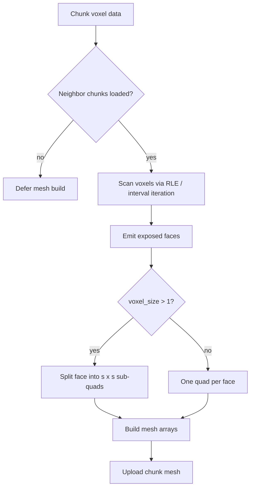

Voxel engine meshing is the stage that converts a chunk's voxel data into the triangle geometry the renderer draws. It sits on the critical path of any streaming voxel world: every chunk that loads, unloads, or changes must be re-meshed, and the per-chunk cost sets the ceiling on how fast the world can fill in around a player. This article covers the meshing design and measured performance of the *aperiodic* engine, a Godot 4 GDScript voxel project, and the structural choices that dominate its cost.

## Engine context

The aperiodic engine targets "Lay of the Land" resolution, where one gameplay block equals one metre. A `voxel_size` parameter in the range 1–4 subdivides each block face into `voxel_size²` sub-quads, so the same block can be rendered at finer geometric detail without changing the world grid [5][10]. Chunks are 16³ voxels and stream around the player at radius 5. Mesh builds are neighbor-gated — a chunk is not meshed until the data it needs from adjacent chunks is available — and voxel generation runs on worker threads [5][10].

One inconsistency in the source material is worth flagging: the engine summary describes per-chunk greedy meshing [5][10], while a later note states plainly that the mesher has no greedy meshing [1][6]. The later note is the more specific claim about the mesher's behaviour, so the greedy-meshing description in the summary should be treated as either outdated or aspirational.

## Face subdivision and the cost of voxel_size

Because there is no greedy meshing, every exposed face is emitted individually. When `voxel_size > 1`, each exposed face is further split into an `s × s` grid of planar sub-quads [1][6]. This multiplies vertex counts by roughly 9× and pushes mesh-build time to 57 ms per chunk at subdivision 3 [3][8]. A separate measurement puts chunk rebuild at 35–37 ms at `voxel_size = 3` [1][6]; the two figures come from different measurement points in the project's history and should not be read as a single benchmark.

The practical consequence is that `voxel_size` is a direct multiplier on meshing work. Raising it buys visual detail at a roughly quadratic cost in quads per face, on top of the per-face emission the mesher already does.

## Measured performance after the mesher work

The "#28 mesher perf" effort landed stages S1–S3 and S5 in change #30, bringing per-chunk meshing from roughly 147 ms down to 22–25 ms [2][7]. The same work brought startup fill time to 1.3 s against a target of ≤6 s [2][7]. That is roughly a 6× improvement in per-chunk cost, and it moved startup fill well inside budget.

## Where the time actually goes

Profiling indicates meshing cost is dominated by scanning voxels rather than by emitting geometry [4][9]. This is the key insight for anyone optimizing a similar engine: the inner loop that walks the chunk volume is the bottleneck, not the quad construction that follows it.

The mitigation is to give the mesher a representation it can skip through. Run-length-encoded or bitmask structures let the mesher advance over homogeneous runs of voxels instead of visiting every cell. Iterating an interval tree or RLE structure in this way measured roughly 30–50× faster than flat-array per-voxel loops [4][9]. Any data layout that preserves run boundaries — and therefore lets the mesher jump rather than step — is worth more than micro-optimizing the face-emission code.

## Mesh build flow

## See also

- Greedy meshing
- Chunk streaming and neighbor gating
- Run-length encoding for voxel storage
- Worker-thread chunk generation
- Godot 4 GDScript performance profiling

---

_Citations link to claims in evidence/claims/. Generated on 2026-09-21._
